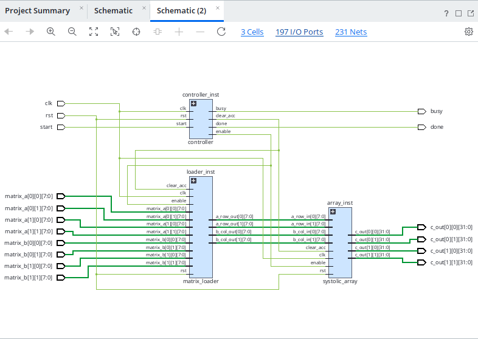
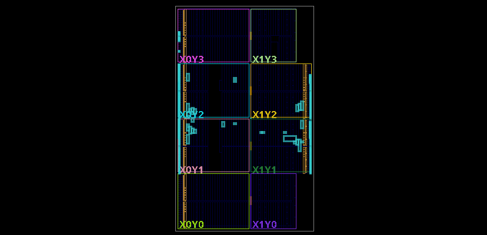

<div align="center">

# 🧠 GreenMatrix

### FPGA AI Matrix Accelerator

*A Parameterized Systolic Array Architecture Built in SystemVerilog*

<br>


---

**GreenMatrix** is an FPGA-based AI accelerator that demonstrates matrix multiplication using a parameterized systolic array architecture. Built entirely in **SystemVerilog**, the project implements reusable hardware modules, simulation-driven verification, and a full synthesis-to-implementation flow on a real Artix-7 device (xc7a100tcsg324-1) using **AMD Vivado**.

The design targets a **2×2 array as a controlled first step**: prove the datapath, control FSM, and load/output timing are correct at small scale — with the array intentionally parameterized so the same RTL scales to 4×4 and 8×8 without a rewrite (see [Future Enhancements](#-future-enhancements)).

</div>

---

# 🚀 Project Highlights

- ✅ Parameterized hardware design (array size is a compile-time parameter, not hardcoded)
- ✅ Reusable Processing Elements (PE)
- ✅ Multiply-Accumulate (MAC) architecture
- ✅ 2×2 Systolic Array
- ✅ Matrix Loader
- ✅ Controller Finite State Machine (FSM)
- ✅ UART TX/RX framework (scaffolded, not yet integrated into top-level control path)
- ✅ Fully simulated with Icarus Verilog
- ✅ Synthesized and implemented in AMD Vivado 2026.1
- ✅ Timing closure achieved on Artix-7 hardware target

---

# 🏗️ System Architecture

```
                 Matrix A Inputs
                       │
                       ▼
              ┌────────────────┐
              │ Matrix Loader  │
              └───────┬────────┘
                      │
                      ▼

           ┌────────────────────────┐
           │    2×2 Systolic Array  │
           │                        │
           │   PE ─────► PE         │
           │   │          │         │
           │   ▼          ▼         │
           │   PE ─────► PE         │
           └────────────────────────┘
                      │
                      ▼

                Matrix C Output
```

Each **PE** contains a MAC unit and forwarding logic: it multiplies its local A/B inputs, accumulates into a running sum, and forwards operands to its neighbor on the next cycle — the standard systolic dataflow that lets the array reuse each loaded operand across multiple MACs instead of re-fetching from memory every cycle.

---

# 📂 Repository Structure

```text
GreenMatrix
│
├── rtl
│   ├── package.sv
│   ├── mac_unit.sv
│   ├── pe.sv
│   ├── systolic_array.sv
│   ├── controller.sv
│   ├── matrix_loader.sv
│   ├── output_buffer.sv
│   ├── uart_rx.sv
│   ├── uart_tx.sv
│   └── greenmatrix_top.sv
│
├── tb
│
├── constraints
│
├── docs
│
├── images
│   ├── GM_synthesis.png
│   └── GM_implementation.png
│
└── README.md
```

---

# ⚙️ Core Modules

| Module | Description |
|---------|-------------|
| **package.sv** | Global parameters and reusable data types |
| **mac_unit.sv** | Multiply-Accumulate arithmetic engine |
| **pe.sv** | Processing Element containing MAC and forwarding logic |
| **systolic_array.sv** | Parameterized N×N systolic array (instantiated as 2×2) |
| **controller.sv** | Finite State Machine controlling load/compute/drain execution phases |
| **matrix_loader.sv** | Loads matrix values into the array |
| **output_buffer.sv** | Collects completed matrix results |
| **greenmatrix_top.sv** | Top-level FPGA integration |

> `uart_rx.sv` / `uart_tx.sv` exist as standalone, individually-simulated modules for a future host-to-FPGA data path. They are **not yet wired into `greenmatrix_top.sv`** — matrix data is currently loaded via testbench/simulation stimulus, not a live UART link.

---

# 🧪 Verification

Each hardware component was verified independently in Icarus Verilog before full integration, then re-checked at the top level post-synthesis.

| Testbench | What was checked |
|---|---|
| **MAC Unit** | Multiply-accumulate correctness across representative operand pairs, including accumulator reset behavior |
| **Processing Element** | Local MAC result plus correct forwarding of A/B operands to neighboring PEs on each clock edge |
| **Controller FSM** | Correct state transitions across load → compute → drain phases, and `busy`/`done` flag timing |
| **Systolic Array (2×2)** | End-to-end dataflow through all 4 PEs against the expected matrix product |
| **Top-Level Integration** | Full `greenmatrix_top` against the worked example below, post-synthesis netlist behavior matched RTL simulation |

---

# 📊 Matrix Multiplication Example

### Input

```
A = |1 2|
    |3 4|

B = |5 6|
    |7 8|
```

### Output

```
C = |19 22|
    |43 50|
```

All simulations completed successfully and matched expected results.

---

# 📈 Implementation Results

Post-implementation timing summary, Vivado 2026.1, target device **xc7a100tcsg324-1**:

| Metric | Setup | Hold | Pulse Width |
|---|---|---|---|
| Worst Slack | **+∞** (WNS) | **+∞** (WHS) | N/A |
| Total Negative Slack | 0.000 ns | 0.000 ns | N/A |
| Failing Endpoints | **0** | **0** | N/A |
| Total Endpoints | 632 | 632 | N/A |

**Timing closure achieved with zero failing endpoints across setup and hold.**

| Resource | Used | Available | Utilization % |
|---|---|---|---|
| LUT | 444 | 63,400 | 0.70% |
| FF | 168 | 126,800 | 0.13% |
| Bonded IOB | 197 | 210 | **93.81%** |
| DSP48 | 0 | — | — |
| BUFGCTRL | 1 | 32 | 3.13% |

**The design is pin-limited, not logic-limited.** LUT and FF utilization sit under 1%, but Bonded IOB usage is at 93.81% — nearly every available I/O pin on this package is committed. That's expected for a fully-parallel interface: each matrix element (A and B, 2×2 each, 8 bits wide) gets its own dedicated input port rather than sharing a bus, so the pin count scales directly with matrix size and word width instead of with logic complexity.

This is the direct motivation for the AXI4/UART items in [Future Enhancements](#-future-enhancements): serializing matrix loads over a bus (rather than exposing every element as a parallel port) is what unlocks scaling to 4×4 and 8×8 without running out of package pins. At 63,400 LUTs and 126,800 FFs available versus 444/168 used, the fabric has more than enough headroom to absorb a much larger array — pin count is the actual constraint on this package.

Also notable: 0 DSP48 slices used, meaning the MAC units are currently implemented in LUT fabric rather than mapped to the FPGA's hard multiply-accumulate blocks. Remapping to DSP48 macros is a straightforward follow-up that would free up more fabric for a larger array and likely improve max clock frequency.

---

# 🔬 Vivado RTL Synthesis

<p align="center">

</p>

---

# ⚡ Vivado Device Implementation

<p align="center">

</p>

---

# 🛠️ Development Tools

- SystemVerilog
- AMD Vivado 2026.1
- Icarus Verilog
- GTKWave
- Git
- GitHub
- Windows PowerShell

---

# 📈 Project Progress

| Stage | Status |
|--------|--------|
| Architecture Design | ✅ Complete |
| RTL Development | ✅ Complete |
| Unit Verification | ✅ Complete |
| System Integration | ✅ Complete |
| Vivado Synthesis | ✅ Complete |
| Vivado Implementation | ✅ Complete |
| Timing Closure | ✅ Complete (WNS +∞, 0 failing endpoints) |
| GitHub Portfolio | ✅ Complete |

---

# 🔮 Future Enhancements

Because the array size, data width, and PE count are all parameterized rather than hardcoded, scaling up is a configuration change plus re-verification — not a redesign:

- 4×4 Systolic Array
- 8×8 AI Accelerator
- AXI4 Interface
- DDR Memory Support
- DMA Engine
- PCIe Interface
- INT8 Quantization
- CNN Acceleration
- Tensor Processing Pipeline
- Wire up UART TX/RX into `greenmatrix_top` for live host-to-FPGA matrix loading

---

# 👩🏽‍💻 Author

**A'Yana Leonard**

U.S. Army Veteran • Physics Student • Mathematics Student • FPGA Design • Digital Hardware • AI Acceleration

---

<div align="center">

### *Building efficient hardware for the next generation of AI acceleration.*

⭐ If you enjoyed this project, consider giving it a star!

</div>
